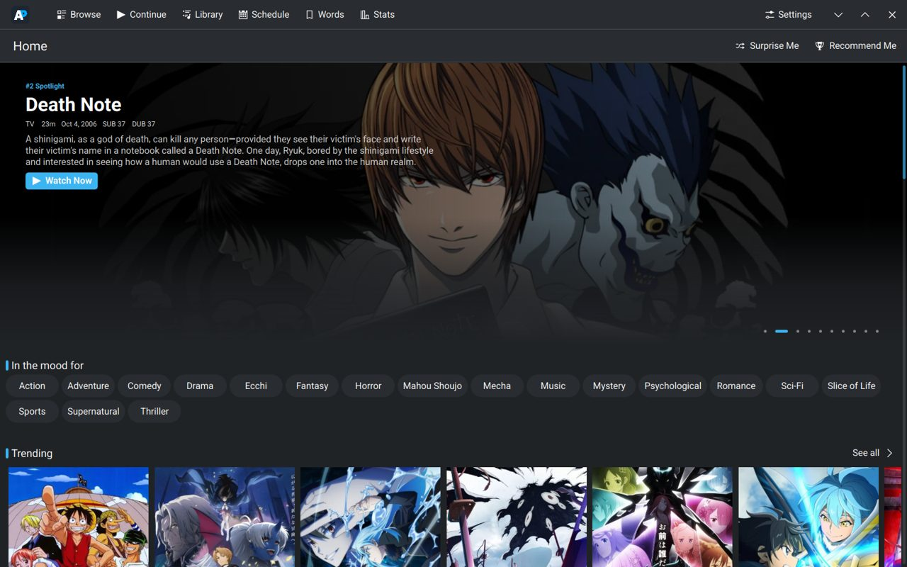
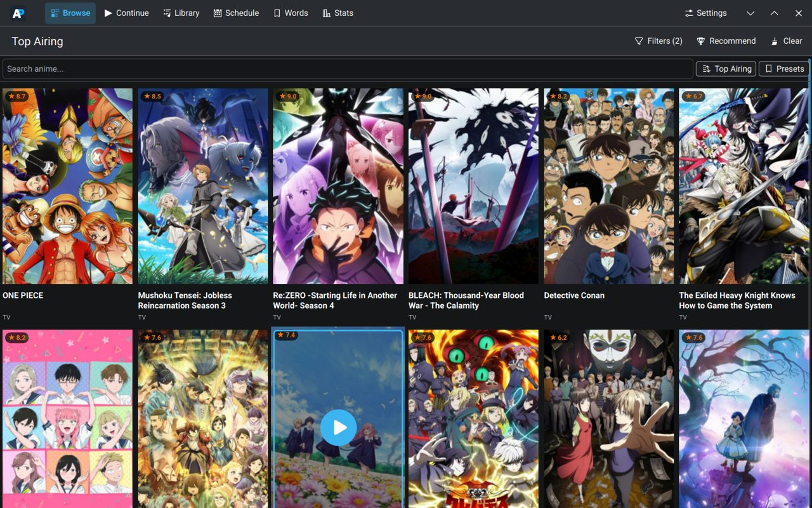
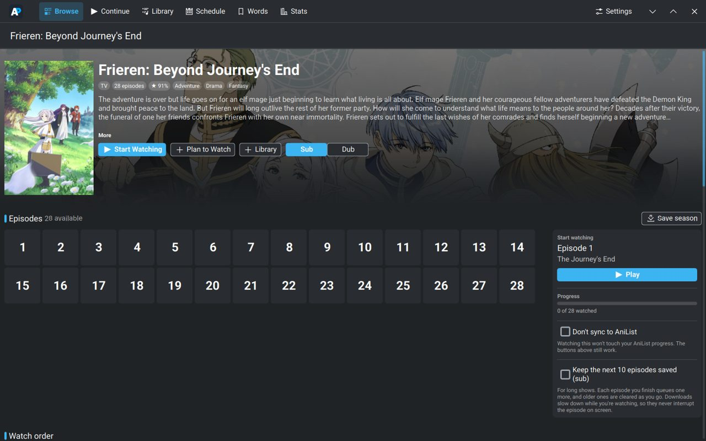
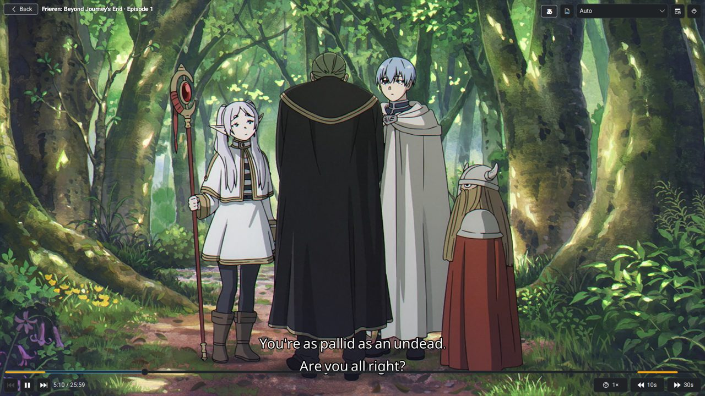
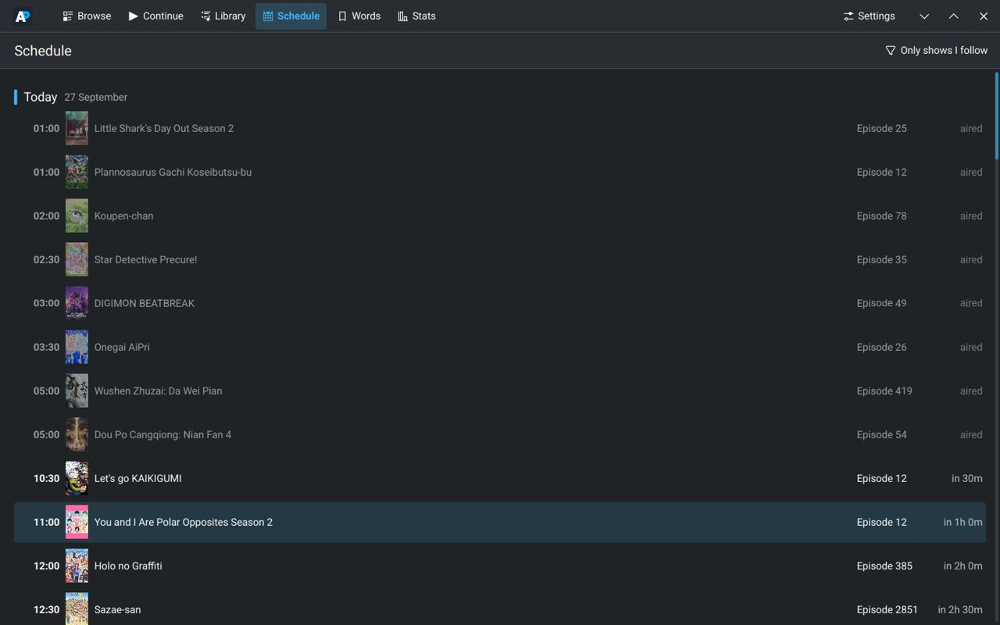
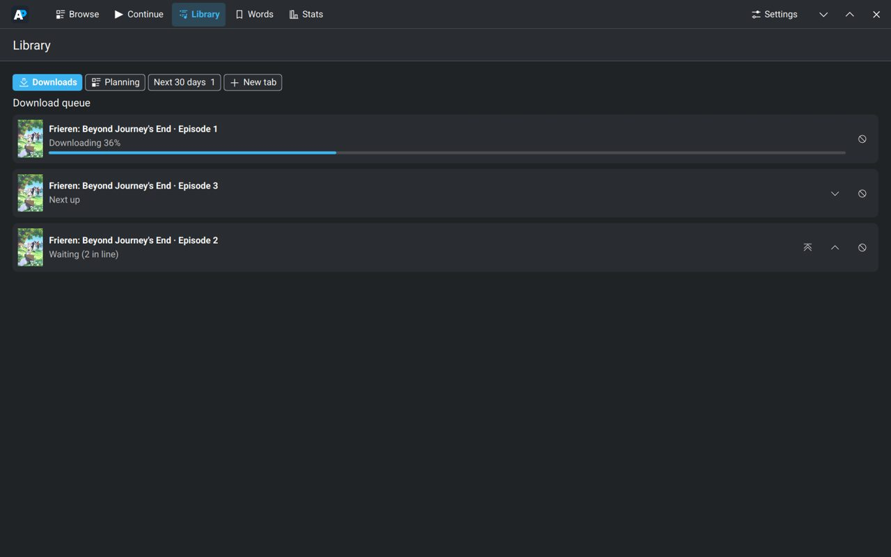

<p align="center">
  
</p>

<h1 align="center">Anime Player</h1>

<p align="center">
  A desktop app for finding, watching and keeping track of anime — with AniList sync,
  offline downloads, and a Learn Japanese mode built into the player.
</p>

<p align="center">
  <a href="https://github.com/Supred502/Anime_Player/releases/latest"><b>Download for Windows</b></a>
  ·
  <a href="#linux">Linux</a>
  ·
  <a href="https://github.com/Supred502/Anime_Player/issues/new">Report a problem</a>
</p>

<p align="center">
  
</p>

## Features

**Watching**
- Sub and dub, with the dub-only episode list when Dub is picked
- Skips intros and outros (and filler, if you want), with a one-click undo
- Keeps your place in every episode, and plays the next one automatically
- Playback speed, subtitle size and height, English subtitles on dubs
- Mini player: keep the episode going in a corner while you browse
- Keyboard shortcuts (press <kbd>?</kbd> in the player), <kbd>F11</kbd> fullscreen

**Keeping track**
- AniList login: progress, Planning list, ratings and your full history sync both ways
- Library tabs of your own, plus Downloads and Planning
- New-episode alerts and a weekly airing schedule for the shows you follow
- Stats: time watched, streaks, favourite genres
- Watch together: a friend's AniList counts the episodes too, for one show

**Offline**
- Download single episodes or whole seasons; a queue you can reorder
- Rolling downloads for long shows: always the next 10 episodes on disk
- Watched episodes clear themselves up (keeping the one before)

**Learn Japanese**
- Japanese subtitles under the English ones, with furigana, romaji and gaps between words
- Point at a word for its meaning, click to save it to your word list
- Words light up as they're spoken, and lines can pause for you to read

**Everything else**
- Phone remote (and "continue on your phone") over your Wi-Fi
- Shows what you're watching on your Discord profile
- Updates itself: new versions are offered inside the app

## Screenshots

| | |
|---|---|
|  |  |
|  |  |
|  | |

## Install

### Windows

Download `AnimePlayer-…-Setup.exe` from the [latest release](https://github.com/Supred502/Anime_Player/releases/latest)
and run it. It installs for your user only, so it doesn't need admin rights.

Windows may say *"Windows protected your PC"*, because the installer isn't signed:
click **More info → Run anyway**.

The app checks for new versions by itself and offers them with a list of what's new.

### Linux

Runs from source. On Fedora (other distributions have the same packages under similar names):

```sh
sudo dnf install python3-pyside6 kf6-kirigami qqc2-breeze-style mpv-libs ffmpeg-free git
git clone https://github.com/Supred502/Anime_Player.git
cd Anime_Player
python3 -m venv --system-site-packages .venv
.venv/bin/pip install -e .
.venv/bin/python -m animeplayer
```

Updates from inside the app pull the new code with git and restart.

## Setting up the optional parts

- **AniList:** Settings → AniList. Make a client at
  [anilist.co/settings/developer](https://anilist.co/settings/developer) with the redirect URL
  `https://anilist.co/api/v2/oauth/pin`, paste its Client ID, log in, and paste the token back.
- **Learn Japanese:** Japanese subtitles come from [Jimaku](https://jimaku.cc). Make a free account,
  generate an API key on your account page, and paste it in Settings.
- **Phone remote:** Settings → Phone remote shows an address and a PIN to open on your phone.

## Found a bug?

Settings → **Report a problem** opens an issue here with your app version and the last errors
already filled in. No GitHub account? Use **Copy details** and send it to me.

## For developers

```sh
.venv/bin/python -m pytest              # the tests
ANIMEPLAYER_COMPAT_UI=1 .venv/bin/python -m animeplayer   # preview the Windows look on Linux
```

Releasing a new version:

```sh
python scripts/release.py patch "What changed, as a short list"
```

That bumps the version, tags it and pushes. GitHub Actions then builds the Windows installer
([.github/workflows/release.yml](.github/workflows/release.yml)) and publishes the release, which
every installed copy picks up.

## Credits

- [AniList](https://anilist.co) for the catalogue, lists and schedule; [AniSkip](https://aniskip.com)
  for intro/outro times; [Jikan](https://jikan.moe) for filler lists
- [mpv](https://mpv.io) for playback and [FFmpeg](https://ffmpeg.org) for downloads
- [Jimaku](https://jimaku.cc) for Japanese subtitles; [JMdict](https://www.edrdg.org/jmdict/j_jmdict.html)
  by the Electronic Dictionary Research and Development Group (CC BY-SA 4.0);
  UniDic, fugashi and cutlet for reading Japanese
- [Qt](https://www.qt.io) / PySide6 and KDE's [Kirigami](https://develop.kde.org/frameworks/kirigami/);
  Breeze icons (LGPL-3.0)
- Inspired by [ani-cli](https://github.com/pystardust/ani-cli)

## Disclaimer

Anime Player does not host or upload any video. It plays what third-party websites already make
publicly available, the same way a web browser would. It is a personal, non-commercial project;
please support the official releases of the shows you love where you can.
